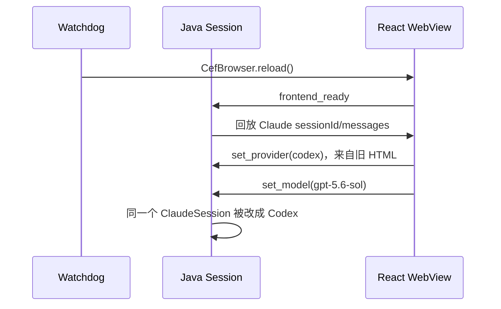
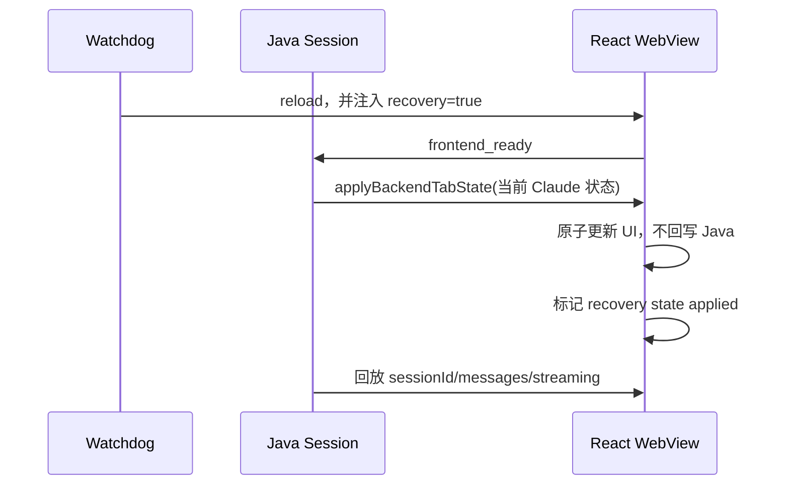

# WebView Watchdog 内存增长与 Reload 状态一致性完整修复方案

## 1. 文档目的

本文主要解决 WebView watchdog 反复调用 `JBCefBrowser.loadHTML()` 导致的内存持续增长，并处理改用原生 `CefBrowser.reload()` 后暴露出的 provider/model 状态回退，确保内存修复不会引入跨 Provider 会话污染。

状态不一致不是与内存问题无关的第二项需求，而是当前内存修复方案必须消除的回归风险。只有同时满足“不再重复注册 HTML payload”和“reload 后会话状态保持一致”，本次内存问题才算完整修复。

本方案按以下优先级保证目标：

1. 解决原始内存问题：watchdog 软恢复不再重复调用 `loadHTML()`，避免完整 WebView HTML payload 持续驻留。
2. 消除内存修复引入的回归：reload 后 provider、model、sessionId、messages 和实际发送路由保持一致。
3. 不破坏多 Tab 各自恢复 provider/model 的能力。
4. 兼容 IDEA 2024.1、2024.3、2025.2 及其对应 JCEF 实现。

## 2. 问题边界与修复链路

本次工作包含一个原始问题和一个修复回归：

| 类型 | 问题 | 本次是否必须解决 |
| --- | --- | --- |
| 原始问题 | watchdog 每次恢复都调用 `loadHTML()`，JCEF 持续注册并保留新的 HTML payload，造成内存增长 | 是，PR 的主要目标 |
| 修复回归 | 改用 `reload()` 后复用首次 HTML，其中固化的旧 provider/model 会覆盖当前 Session | 是，安全合入内存修复的必要条件 |

完整修复链路为：

```text
重复 loadHTML 导致内存增长
  → 改用 CefBrowser.reload() 复用当前 URL
  → 阻止旧 HTML boot 状态回写 Java
  → 由 Java 向 reload 后的页面恢复当前会话状态
  → 同时满足内存稳定与会话状态一致
```

## 3. 原始内存问题与当前修复

原 watchdog 恢复流程重复调用 `JBCefBrowser.loadHTML(html)`。JCEF 会为每次 HTML payload 注册一个新的随机 URL；平台级 load-HTML request map 会继续持有旧 URL 对应的完整文档。watchdog 恢复次数增加时，保留的 HTML payload 也随之累积，表现为 IDE/JCEF 内存持续增长。

当前修复将软恢复改为：

```java
cefBrowser.reload();
```

原生 reload 会复用首次 `loadHTML()` 注册的 URL，不再为每次软恢复注册新的 HTML payload，因此是内存问题的正确修复方向。但是，首次 HTML 中还固化了创建 WebView 时的 Tab 状态：

```javascript
window.__INITIAL_TAB_PROVIDER__ = 'codex';
window.__INITIAL_TAB_MODEL__ = 'gpt-5.6-sol';
```

用户在 WebView 创建后切换 provider/model，Java Session 已经更新，首次 HTML 中的值却不会变化。原生 reload 重新执行旧 HTML 后，React 会再次读取旧值并通过 `set_provider`、`set_model` 回写 Java。

## 4. 已确认的状态回归复现场景

实机环境：

- IDEA 2025.2.6.2
- 插件版本：`0.4.9-memLeakFix`
- WebView 首次创建状态：Codex / `gpt-5.6-sol`
- reload 前实际状态：Claude / `claude-opus-4-8[1m]`
- 当前会话包含 Claude 历史消息

通过暂停对应 JCEF renderer 触发 watchdog 后，日志顺序如下：

1. watchdog 检测心跳和 RAF 超时，执行原生 reload。
2. 前端上报 `frontend_ready`。
3. Java 回放当前 Claude sessionId 和 4 条 Claude 消息。
4. 约 300ms 后，React mount-only effect 读取首次 HTML 中的 Codex 快照。
5. 前端发送 `set_provider:codex` 和 `set_model:gpt-5.6-sol`。
6. Java 将同一个 ClaudeSession 原地修改为 Codex，并停止 Claude daemon。

最终形成分裂状态：

| 状态字段 | reload 后的值 |
| --- | --- |
| 页面消息 | Claude 历史 |
| sessionId | Claude sessionId |
| provider | Codex |
| model | `gpt-5.6-sol` |
| 后续发送路由 | Codex |
| Claude daemon | 已停止 |

如果用户继续发送消息，系统可能尝试通过 Codex bridge 恢复 Claude sessionId，导致发送失败、意外创建 Codex 会话，或在 Claude 历史界面中继续展示 Codex 交互。

该场景用于验证当前内存修复是否引入行为回归；它不改变本次工作的主要目标仍是解决 watchdog 内存增长。

## 5. 根因分析

### 5.1 原始内存增长的根因

`JBCefBrowser.loadHTML()` 不是普通的原地页面刷新。每次调用都会为传入的完整 HTML 文档注册新的 URL/payload 映射。watchdog 把它当作可重复恢复操作后，恢复次数与平台持有的 HTML payload 数量形成增长关系。

因此，内存修复必须满足：watchdog 的常规软恢复只重载已经注册的 URL，不能再次提交完整 HTML。只有需要释放并重建 browser 的升级恢复路径才允许重新创建 WebView。

### 5.2 当前修复存在三个状态来源

当前 provider/model 相关状态同时来自：

1. Java `ClaudeSession` 和 `HandlerContext`。
2. 首次 HTML 注入的 `__INITIAL_TAB_PROVIDER__` / `__INITIAL_TAB_MODEL__`。
3. 所有 WebView Tab 共享的 `localStorage`。

首次启动时三者通常一致。用户切换 provider 后，只有 Java Session 和前端运行态发生变化，首次 HTML 仍然保留旧快照。

### 5.3 启动同步和用户操作复用了相同命令

`useModelStatePersistence` 在每次 React 挂载后发送：

```text
set_provider
set_model
set_codex_fast_mode
```

这些命令不是无副作用的状态确认。`set_provider` 会：

- 修改 `HandlerContext.currentProvider`；
- 修改当前 `ClaudeSession.provider`；
- 在 Claude 切换到其他 provider 时停止 Claude daemon；
- 改变 slash commands、usage 和后续 SDK 路由。

因此，页面恢复期间的旧启动快照被错误解释成了一次真实的用户 Provider 切换。

### 5.4 恢复顺序存在竞态

当前时序如下：



Java 回放当前会话不能解决问题，因为旧 boot sync 会在回放之后再次覆盖 Java。

## 6. 修复原则

1. **watchdog 软恢复不得新增 `loadHTML()` payload。**
2. **Java Session 是已有会话和恢复流程的唯一真源。**
3. **HTML 注入值只允许用于首屏展示，不能在 reload 后修改 Java。**
4. **`localStorage` 只保存新建空 Tab 的默认偏好和 UI 偏好，不能覆盖已恢复会话。**
5. **Java → 前端的状态恢复不能触发前端 → Java 的回写环路。**
6. **恢复标记必须先于 `sendToJava` 暴露，boot sync 不能抢先发送。**
7. **Java 状态早于 React callback 注册时必须被缓冲，不能丢失。**

## 7. 推荐的完整修复协议

### 7.1 使用原生 reload 解决内存增长

watchdog 第一次软恢复继续调用：

```java
cefBrowser.reload();
```

不得退回重复 `loadHTML()`。这是本次内存修复的基础。watchdog 后续失败仍可升级为完整 recreate；recreate 会释放旧 browser 和 bridges，再从当前 Java Session 重新生成 HTML。

### 7.2 注入 recovery 加载标记

`WebviewInitializer` 在 watchdog reload 或 recreate 开始时标记当前页面为恢复加载。在 `onLoadEnd` 注入 bridge 时，同步注入 recovery 标记：

```javascript
window.__CCGUI_RECOVERY_RELOAD__ = true;
window.sendToJava = function (message) { /* JCEF JSQuery */ };
```

标记与 `window.sendToJava` 必须在同一段 JavaScript 中按上述顺序注入，确保前端能够发送 bridge 消息时一定已经知道当前加载类型。正常 `onLoadEnd` 和 remote-JCEF fallback 注入必须共用同一个脚本构造方法。

### 7.3 recovery 时禁止 boot sync 修改 Java

`useModelStatePersistence` 仍可读取 HTML/localStorage 完成临时 UI hydration，但在真正执行 `syncToBackend()` 时必须读取最新加载上下文：

```typescript
if (window.__CCGUI_RECOVERY_RELOAD__ === true) {
  return;
}
```

watchdog reload 期间至少禁止发送：

- `set_provider`
- `set_model`
- 任何可能改变当前 Session 路由或配置的 boot 命令

不能只在 React effect 创建时缓存 `recovery`，因为 effect 运行时 bridge/load context 可能尚未注入。判断应放在实际发送命令的位置。

### 7.4 Java 下发权威 Tab 状态

前端 bridge 可用后按现有协议发送 `frontend_ready`。Java 从当前 `ClaudeSession` 读取实时状态，而不是读取首次 HTML 快照，并下发统一 payload：

```json
{
  "provider": "claude",
  "model": "claude-opus-4-8[1m]",
  "permissionMode": "default",
  "reasoningEffort": null,
  "codexFastMode": "normal",
  "sessionId": "b4ac5788-5967-4033-a9bd-23ddc6bde675"
}
```

建议新增语义明确的前端入口：

```javascript
window.applyBackendTabState(payload);
```

不要继续用现有 `onModelConfirmed` 拼接恢复流程，因为它只覆盖 model，不能原子同步 provider、sessionId 和其他会话配置。

### 7.5 前端原子应用状态且不回写 Java

`applyBackendTabState` 只能更新 React 状态：

- `setCurrentProvider`
- `setSelectedClaudeModel` / `setSelectedCodexModel`
- `setPermissionMode`
- `setReasoningEffort`
- `setCodexFastMode`
- 当前 sessionId

应用期间，相关 persistence effect 不能：

- 向 Java 回写状态；
- 把旧 HTML 状态写入 `localStorage`；
- 触发新会话或 Provider 切换副作用。

Java 下发的恢复状态不是用户操作，因此不能发送 `set_provider`、`set_model` 或 `create_new_session`。

### 7.6 缓冲早到的 Java 状态并保护 localStorage

`main.tsx` 在 React 挂载前预注册 `window.applyBackendTabState` placeholder。Java 状态早到时保存到 `window.__pendingBackendTabState`，React callback 注册后立即消费该 payload。

权威状态应用完成时设置：

```javascript
window.__CCGUI_RECOVERY_STATE_APPLIED__ = true;
```

在 `__CCGUI_RECOVERY_RELOAD__` 尚未注入、页面类型仍未知时，也必须视为不可持久化；否则 React mount effect 可能早于 `onLoadEnd` 写入旧状态。前端通过有上限的短轮询等待页面类型确定。recovery 页面在权威状态应用标记出现前同样不得写入共享 `localStorage`。React 状态更新会重新触发 persistence effect，此时才保存已经由 Java 校正后的值。

推荐时序如下：



### 7.7 恢复派生 UI 状态

旧 boot sync 的 `set_provider/set_model` 还会顺带刷新 usage limit 和编辑器 context bar。recovery 禁止这些命令后，Java 必须通过无状态变更副作用的 `UsagePushService` 主动刷新派生 UI，不能为了恢复显示再次修改 Session。计算 Claude usage limit 前必须复用正常 `set_model` 的 provider 配置映射，例如将 `claude-sonnet-*` 解析为实际配置的 `glm-4.7[1M]` 后再计算容量。

## 8. 启动偏好与多 Tab 恢复

### 8.1 状态优先级

已有或恢复中的会话：

```text
Java Session > HTML 首屏快照 > localStorage
```

真正的新空 Tab：

```text
从源 Tab 继承的偏好或 localStorage > Java 默认值
```

### 8.2 保留 issue #1353 的能力

多 Tab 恢复时不能让共享 `localStorage` 覆盖每个 Tab 独立保存的 provider/model。

HTML 注入可以暂时保留，用于 Java bridge 尚未就绪时减少 UI 闪烁；但它不再拥有回写 Java 的权限。最终状态始终由 Java 权威快照确认。

### 8.3 区分启动同步和用户操作

不应继续让启动同步复用用户操作的 `set_provider/set_model`。建议新增独立事件：

```text
bootstrap_tab_preferences
```

Java 处理规则：

- `INITIAL` 且当前是无历史、无权威恢复状态的新空会话：可以接受偏好建议。
- 已恢复持久化会话：忽略前端偏好，返回 Java 当前状态。
- `WATCHDOG_RELOAD`：禁止修改 Session。

这是后端防御层。即使未来前端错误发送了旧 boot 状态，也不能把已有 Claude 会话原地修改成 Codex。

## 9. 正常 Provider 切换的边界

用户主动切换 Provider 当前会执行真实会话迁移：

```text
set_provider
create_new_session
```

本次修复不应大范围重构该流程，以免扩大 PR 风险。后续可以单独将它优化成 Java 侧原子命令，例如 `switch_provider_and_create_session`，避免两个异步命令之间出现中间状态。

本次必须保证的是：boot/recovery 状态永远不能伪装成用户主动切换。

## 10. 预计改动范围

### Java

#### `WebviewInitializer.java`

- reload/recreate 时标记 recovery。
- 将 recovery 标记与 bridge 一起注入。
- 保留 `CefBrowser.reload()`。

#### `ChatWindowDelegate.java`

- `frontend_ready` 后下发 Java 权威 Tab 状态。
- `frontend_ready` 后先下发当前 Java Session 状态，再回放会话。
- 通过无副作用服务恢复 usage/context bar。

#### Handler 层

- 建议增加 `bootstrap_tab_preferences`。
- recovery 的 bootstrap 请求不得修改 Session。

### WebView

#### `useModelStatePersistence.ts`

- recovery 时禁止 boot sync。
- Java 权威状态应用完成前暂停持久化副作用。
- 保留新空 Tab 的偏好恢复。

#### window callback

- 新增 `applyBackendTabState`。
- 支持 Java 回调早于 React callback 注册时的 pre-React buffering。
- UI-only 更新，不反向发送 bridge 命令。
- 应用完成后解除 recovery localStorage 门禁。

#### `global.d.ts`

- 声明 recovery 标记、`applyBackendTabState` 和 pending payload 类型。

## 11. 不推荐的修复方式

### 11.1 恢复重复调用 `loadHTML()`

会重新引入内存增长，是不可接受的回退。

### 11.2 reload 前修改当前页面的全局变量

```javascript
window.__INITIAL_TAB_PROVIDER__ = 'claude';
window.location.reload();
```

页面 reload 后会重新执行原 HTML，运行时变量不会保存。

### 11.3 使用共享 localStorage 保存当前 Tab 状态

多个 WebView Tab 共享 localStorage，会重新引入跨 Tab provider/model 串扰。

### 11.4 只在前端跳过一次 `set_provider`

它能阻止当前复现，但不能解决：

- UI 仍显示旧 HTML 状态；
- 连续 reload 的旧回调覆盖新页面；
- 用户在恢复窗口内发送消息；
- 未来其他 boot 命令再次修改 Session；
- 后端缺少防御性校验。

### 11.5 依赖 JCEF 内部稳定 URL 映射

不同 IDEA/JCEF 版本的内部 `loadHTML` 注册实现并非公开稳定契约，不适合作为跨版本修复基础。

## 12. 测试方案

### 12.1 Java 单元测试

1. watchdog 第一次恢复只调用一次 `reload()`。
2. reload 不调用 `loadHTML()`。
3. reload 在暴露 bridge 前注入 `recovery=true`。
4. `frontend_ready` 下发当前 Session 状态，而不是首次 HTML 状态。
5. recovery bootstrap 不能修改 provider/model/sessionId。
6. recreate 从当前 Session 生成新的首屏状态。
7. recovery 会按自定义 Claude 模型映射无副作用地刷新 usage/context bar。
8. streaming 状态在 reload 后正确回放。

Java 测试类和测试方法必须按项目规范补充或更新注释，明确测试方法与目标。

### 12.2 React 单元测试

核心回归用例：

```text
首次 HTML：codex / gpt-5.6-sol
Java 当前状态：claude / claude-opus-4-8[1m]
当前消息：Claude 历史
加载原因：WATCHDOG_RELOAD
```

最终断言：

```text
UI provider = claude
UI model = claude-opus-4-8[1m]
消息仍为 Claude
没有发送 set_provider:codex
没有发送 set_model:gpt-5.6-sol
没有发送 create_new_session
```

还需要覆盖：

1. 首次启动仍可恢复新空 Tab 偏好。
2. 多 Tab 分别恢复 Claude 和 Codex。
3. Java 状态早于 React callback 注册时能够正确缓冲。
4. React 先挂载、recovery 标记后注入时不会提前写入共享 localStorage。
5. Java 状态应用不会触发反向 bridge 命令。
6. 权威状态到达前不会写入共享 localStorage。
7. streaming reload 后继续接收增量消息。
8. recreate 和 native reload 最终行为一致。

### 12.3 实机兼容测试

在以下版本分别执行：

- IDEA 2024.1
- IDEA 2024.3
- IDEA 2025.2

每个版本执行：

1. 使用 Codex 创建 WebView。
2. 切换到 Claude 并产生历史消息。
3. 暂停对应 JCEF renderer，触发 watchdog reload。
4. 恢复 renderer。
5. 确认 provider、model、sessionId、messages 和实际发送路由均为 Claude。
6. 对 Claude → Codex 方向执行反向测试。
7. 验证 IDE 休眠唤醒。
8. 验证同时打开 5～7 个项目。
9. 验证 active streaming 时的恢复。
10. 连续触发 10～20 次恢复，确认内存不再线性增长。

## 13. 验收标准

内存正确性（原始问题）：

- watchdog 软恢复不调用新的 `loadHTML()`。
- 连续恢复后 JCEF loadHTML payload 数量不随次数线性增长。
- browser recreate 能释放旧 browser、JSQuery bridges 和 native renderer 资源。

功能正确性（内存修复回归）：

- reload 前后 provider、model、sessionId、messages、permission mode 和发送路由一致。
- reload 不创建新会话，不清空历史，不停止错误的 provider daemon。
- 多 Tab 不互相覆盖 provider/model。
- 权威状态应用前不会把旧 HTML 状态发布到共享 localStorage。

兼容性：

- 不依赖 JCEF 私有 HTML URL 映射行为。
- 只使用项目已有的 `reload()`、`executeJavaScript()` 和 JSQuery bridge 能力。
- IDEA 2024.1、2024.3、2025.2 行为一致。

## 14. 实施建议

建议按以下顺序实现：

1. 保留并锁定原生 `reload()`，增加测试确保软恢复不再调用 `loadHTML()`。
2. 增加 recovery 标记和 boot-sync 拦截。
3. 增加 Java 权威状态 payload 与前端原子应用入口。
4. 增加 pre-React 缓冲和 recovery localStorage 门禁。
5. 恢复 usage/context bar 等派生 UI 状态。
6. 补齐 Java/React 回归测试。
7. 完成三个 IDEA 版本的实机验证。
8. 重复触发 watchdog 并进行内存验证。

其中第 1～5 项应作为本次 watchdog 内存修复整体完成：第 1 项解决原始内存增长，第 2～5 项确保内存修复不会引入状态回退和跨 Provider 会话污染。若未来允许多个页面导航或多个恢复请求并发，再增加 generation/ack 协议；当前 watchdog 在 EDT 上串行发起 reload，不需要为本次修复引入该复杂度。正常 Provider 切换的原子化也可以后续单独提交，避免扩大本 PR 的行为变化范围。
