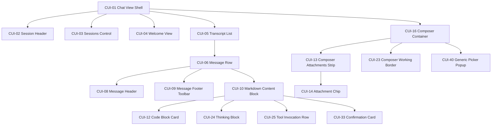

# Mapping des VS Code Workbench Chat in eine komponentisierte CoDriver-Implementierung

## Executive Summary

Die belastbare technische Referenz für den sichtbaren Chat-Aufbau liegt im aktuellen Stand primär im VS-Code-Workbench-Chat unter `src/vs/workbench/contrib/chat/browser/...`, nicht in `extensions/copilot`. Dafür sprechen erstens die direkten Style-Imports des Chat-Widgets (`chat.css`, `chatAgentHover.css`, `chatViewWelcome.css`) und zweitens die Tatsache, dass der Copilot-README selbst die tiefe UI-Integration und den Release-Gleichlauf mit VS Code hervorhebt. Für ein CoDriver-Klickdummy, das optisch möglichst exakt wie der originale Copilot-Chat wirkt, musst du daher den Workbench-Chat als Quellwahrheit behandeln und `extensions/copilot` nur ergänzend für Semantik, nicht für die Primär-UI, heranziehen. citeturn41view0turn17view5

Architektonisch ist die UI in VS Code bereits stark komponentisiert: `ChatViewPane` kapselt den Host-Container, `ChatWidget` baut das eigentliche `.interactive-session`-Layout auf, `ChatListWidget` und `ChatListRenderer` rendern Transcript und Zeilen, `ChatInputPart` baut den Composer mit Attachment-Zone, Toolbars und Follow-ups, und spezialisierte Content-Parts wie `ChatThinkingContentPart`, `ChatToolInvocationPart`, `ChatConfirmationContentPart` und `CodeBlockPart` übernehmen die inhaltlichen Blöcke. Diese Struktur lässt sich gut in CoDriver spiegeln, wenn du die Workbench-spezifischen Dienste abkoppelst und die DOM-/CSS-Sprache möglichst nah beibehältst. citeturn39view0turn42view1turn13view0turn40view1turn26view1turn26view3turn27view0turn27view2

Für die Portierungsstrategie ergibt sich ein klares Muster: Oberflächennahe CSS- und DOM-Strukturen solltest du überwiegend **copy/adapt** übernehmen, während Workbench-spezifische Infrastruktur wie `WorkbenchObjectTree`, QuickInput-Controller, Toolbar-Menüs, Kontextkeys oder Monaco-spezifische Editor-Pools meist **adapt** oder **rebuild behind same DOM contract** erfordern. Besonders gut direkt portierbar sind der Composer-Rahmen, die Working-Border, Attachment-Chips, Welcome-Prompts und große Teile der Message-Card- und Confirmation-CSS. Weniger 1:1 portierbar sind die Transcript-Virtualisierung, Tool-Invocation-Subparts und globale Picker-/Popup-Systeme. citeturn6view1turn6view2turn7view1turn30view3turn37view0turn33view0

Wichtig für die visuelle Exaktheit ist außerdem: VS Code arbeitet fast überall tokenbasiert. Zentrale Farben kommen nicht als freie Hexwerte im Chat-CSS vor, sondern über Variablen wie `--vscode-input-background`, `--vscode-input-border`, `--vscode-focusBorder`, `--vscode-textLink-foreground`, `--vscode-chat-requestBorder` oder `--vscode-chat-inputWorkingBorderColor1`. In den Standard-Themes sind dafür konkrete Werte vorhanden, etwa im Theme `2026-dark.json` für `input.background`, `input.border`, `quickInput.background`, `quickInputList.focusBackground`, `quickInput.border` und die Working-Border-Farben `chat.inputWorkingBorderColor1..3`. Für CoDriver solltest du deshalb ein eigenes `--codriver-*`-Tokenset anlegen und diese Token systematisch darauf abbilden. citeturn6view1turn7view1turn19view0turn19view3turn19view4turn38view0turn38view3

## Arbeitsannahmen und Must-Scope-Baum

Die von dir referenzierten Must-Scope-Komponenten binde ich hier auf die 18 zuvor besprochenen Kernbausteine. Wo die frühere exakte Bezeichnung im aktuellen Turntext nicht mehr wörtlich sichtbar ist, normalisiere ich sie auf die jeweilige UI-Funktion. Der Baum unten ist damit implementation-ready und für die Klassenkapselung im CoDriver-Webview gedacht.



Die oberste tatsächliche Renderstruktur in VS Code entspricht diesem Baum recht gut: `ChatViewPane` setzt `.chat-viewpane`, `ChatWidget` rendert `.interactive-session`, darin entstehen wahlweise Welcome-Container, `.interactive-list` und der Input-Bereich; `ChatInputPart` erzeugt wiederum `.interactive-input-part` mit `.chat-input-container`, `.chat-attached-context`, Editor und Toolbars. citeturn39view0turn42view1turn13view0

Als visuelle Kernreferenz für den Composer solltest du den aktuellen Input-Rahmen inklusive Working-Border übernehmen. Schon der Basiskasten ist in `chat.css` präzise als `background-color: var(--vscode-input-background)`, `border: 1px solid var(--vscode-input-border, transparent)` und `border-radius: var(--vscode-cornerRadius-large)` modelliert; der Arbeitszustand wird über zusätzliche `::before`-/`::after`-Ringe und `conic-gradient` gesteuert. citeturn6view1turn7view1turn7view2

```css
.monaco-workbench .interactive-session .chat-input-container {
  background-color: var(--vscode-input-background);
  border: 1px solid var(--vscode-input-border, transparent);
  border-radius: var(--vscode-cornerRadius-large);
}

.monaco-workbench .interactive-session .chat-input-container.working::before,
.monaco-workbench .interactive-session .chat-input-container.working::after {
  opacity: 1;
}
```

Diese verkürzte Referenz ist direkt aus den in `chat.css` verwendeten Selektoren und Regeln abgeleitet; für die exakte Animation kommen zusätzlich `--chat-input-anim-duration`, `--chat-input-working-border-color1`, `@property --chat-input-anim-angle` und `chat-input-working-border-spin` dazu. citeturn6view1turn6view2turn6view5turn7view1turn7view2

## CUI-zu-VS-Code-Mappingtabelle

| CUI-ID | VS-Code-Quellpfade | Vorgeschlagene CoDriver-Komponente | Porting |
|---|---|---|---|
| CUI-01 | `src/vs/workbench/contrib/chat/browser/widgetHosts/viewPane/chatViewPane.ts`, `.../media/chatViewPane.css`, `src/vs/workbench/contrib/chat/browser/widget/chatWidget.ts` citeturn34view1turn35view2turn42view1 | `CoDriverChatViewShell` | adapt |
| CUI-02 | `src/vs/workbench/contrib/chat/browser/widgetHosts/viewPane/chatViewTitleControl.ts`, `.../media/chatViewTitleControl.css` citeturn35view0turn35view1 | `CoDriverSessionHeader` | adapt |
| CUI-03 | `src/vs/workbench/contrib/chat/browser/widgetHosts/viewPane/chatViewPane.ts`, `.../media/chatViewPane.css`, Agent-Sessions-Bereiche im gleichen Host-Teilbaum citeturn34view0turn35view2 | `CoDriverSessionsSidebar` | adapt |
| CUI-04 | `src/vs/workbench/contrib/chat/browser/widget/media/chatViewWelcome.css`, `src/vs/workbench/contrib/chat/browser/viewsWelcome/chatViewWelcomeController.ts`, `chatWidget.ts` citeturn8view2turn11view1turn42view1 | `CoDriverWelcomeView` | copy/adapt |
| CUI-05 | `src/vs/workbench/contrib/chat/browser/widget/chatWidget.ts`, `chatListWidget.ts`, `widget/media/chat.css` citeturn42view1turn33view0turn5view0 | `CoDriverTranscriptList` | rebuild |
| CUI-06 | `src/vs/workbench/contrib/chat/browser/widget/chatListRenderer.ts`, `widget/media/chat.css` citeturn40view1turn5view0 | `CoDriverMessageRow` | copy/adapt |
| CUI-08 | `chatListRenderer.ts`, `widget/media/chat.css`, `widget/media/chatAgentHover.css` citeturn40view1turn5view1turn8view0 | `CoDriverMessageHeader` | copy/adapt |
| CUI-09 | `chatListRenderer.ts`, `widget/media/chat.css` citeturn40view1turn5view2turn7view3 | `CoDriverMessageFooterToolbar` | adapt |
| CUI-10 | `widget/media/chat.css`, `chatContentMarkdownRenderer.ts`, `chatListRenderer.ts` citeturn7view3turn12view6turn40view1 | `CoDriverMarkdownBlock` | adapt |
| CUI-12 | `chatContentParts/codeBlockPart.ts`, `chatContentParts/media/codeBlockPart.css` citeturn26view1turn29view2 | `CoDriverCodeBlockCard` | adapt/rebuild |
| CUI-13 | `widget/input/chatInputPart.ts`, `widget/media/chat.css` citeturn13view0turn43view0 | `CoDriverComposerAttachmentsStrip` | copy/adapt |
| CUI-14 | `chatContentParts/chatAttachmentsContentPart.ts`, `widget/media/chat.css`, `attachments/chatAttachmentWidgets.js` via Imports citeturn27view1turn43view0 | `CoDriverAttachmentChip` | copy/adapt |
| CUI-16 | `widget/input/chatInputPart.ts`, `widget/media/chat.css`, `widget/chatWidget.ts` citeturn13view0turn6view1turn42view1 | `CoDriverComposerContainer` | copy/adapt |
| CUI-23 | `widget/media/chat.css`, `widget/chatWidget.ts` citeturn6view1turn6view5turn7view1turn42view1 | `CoDriverComposerWorkingBorder` | copy/adapt |
| CUI-24 | `chatContentParts/chatThinkingContentPart.ts`, `chatContentParts/media/chatThinkingContent.css` citeturn26view3turn31view0turn31view1 | `CoDriverThinkingBlock` | adapt |
| CUI-25 | `chatContentParts/toolInvocationParts/chatToolInvocationPart.ts`, `.../chatToolConfirmationSubPart.ts`, `chatConfirmationWidget.css`, `chatThinkingContent.css` citeturn27view2turn28view1turn30view3turn31view0 | `CoDriverToolInvocationRow` | rebuild behind same DOM |
| CUI-33 | `chatContentParts/chatConfirmationContentPart.ts`, `chatConfirmationWidget.ts`, `chatConfirmationWidget.css` citeturn27view0turn28view0turn30view3 | `CoDriverConfirmationCard` | copy/adapt |
| CUI-40 | `widget/input/modelPickerActionItem.ts`, `modePickerActionItem.ts`, `permissionPickerActionItem.ts`, `chatInputPickerActionItem.ts`, `platform/quickinput/browser/quickInputController.ts`, `.../media/quickInput.css` citeturn36view0turn36view1turn36view2turn14view5turn36view3turn37view0 | `CoDriverPickerPopup` | adapt/rebuild |

## Komponentensteckbriefe für Shell und Transcript

**CUI-01 — Chat View Shell**  
**CoDriver-Klasse:** `CoDriverChatViewShell`.  
**Baum/Nesting:** Root des Chat-Panels; enthält Session-Header, optional Sessions-Control, Welcome oder Transcript und den Composer. In VS Code hängt `.interactive-session` innerhalb von `.chat-viewpane .chat-controls-container`. citeturn35view2turn42view1  
**Quellen:** `chatViewPane.ts`, `chatViewPane.css`, `chatWidget.ts`. `ChatViewPane` setzt die Klasse `.chat-viewpane`; `ChatWidget` hängt darin `.interactive-session` an. citeturn39view0turn42view1  
**Selektoren/Tokens:** `.chat-viewpane`, `.voice-agent-controls-wrapper`, `.chat-controls-container`, `.interactive-session`; relevante Tokens sind `--vscode-panel-border` und die vom ChatWidget gesetzten Runtime-Variablen `--vscode-chat-list-background`, `--vscode-interactive-session-foreground`, `--vscode-interactive-result-editor-background-color`. citeturn35view2turn41view1  
**Zustände:** normal, mit Sessions-Control, Side-by-Side links/rechts, gestapelt, Panel/AuxiliaryBar/Sidebar, Voice-Bar aktiv. citeturn35view2turn39view1  
**Portierung:** **adapt**. Das DOM-Layout und die Klassen solltest du übernehmen; Docking, Host-Resizing und Toolbars musst du im JetBrains-/Webview-Host nachbauen.  
**Token-Mapping:** `--vscode-panel-border` → `--codriver-panel-border`, `--vscode-chat-list-background` → `--codriver-chat-surface`, `--vscode-interactive-session-foreground` → `--codriver-chat-foreground`. citeturn35view2turn41view1

**CUI-02 — Session Header**  
**CoDriver-Klasse:** `CoDriverSessionHeader`.  
**Baum/Nesting:** unterhalb der View-Shell, oberhalb von Welcome/Transcript; trägt Links-Navigation und Rechts-Actions. citeturn35view0  
**Quellen:** `chatViewTitleControl.ts` plus Styling-Datei `media/chatViewTitleControl.css`, die im Controller importiert wird. citeturn35view0turn35view1  
**Selektoren/Tokens:** `.chat-view-title-container`, `.chat-view-title-inner`, `.chat-view-title-navigation-toolbar`, `.chat-view-title-actions-toolbar`, `.chat-view-title-label`. Die exakten CSS-Regeln der CSS-Datei habe ich in dieser Recherche nicht einzeln ausgelesen; die Datei existiert aber als dedizierter Titel-Style-Einstiegspunkt. citeturn35view0turn35view1  
**Zustände:** unsichtbar, wenn kein Titel vorhanden; sichtbar mit Titel; fokussierbar; Session-Picker-Aktion aktiv. citeturn35view0  
**Portierung:** **adapt**. Toolbar-Konzept und DOM-Namen übernehmen, Menü- und Focus-Mechanik lokal aufbauen.  
**Token-Mapping:** `--vscode-foreground` → `--codriver-title-foreground`, Toolbar-Hover-Tokens → `--codriver-toolbar-*` bei Umsetzung der Title-Actions. Die konkreten Title-CSS-Tokens sind im extrahierten Material noch unvollständig.  

**CUI-03 — Sessions Control**  
**CoDriver-Klasse:** `CoDriverSessionsSidebar`.  
**Baum/Nesting:** sibling zum eigentlichen Chat innerhalb `.voice-agent-controls-wrapper`; kann gestapelt oberhalb oder seitlich neben dem Transcript liegen. citeturn35view2turn39view0  
**Quellen:** `chatViewPane.ts`, `chatViewPane.css`, Verzeichnis `widgetHosts/viewPane`. citeturn34view0turn35view2  
**Selektoren/Tokens:** `.chat-viewpane.has-sessions-control`, `.agent-sessions-container`, `.agent-sessions-title-container`, `.agent-sessions-toolbar`, `.sessions-control-orientation-stacked`, `.sessions-control-orientation-sidebyside`, `.chat-view-position-left`, `.chat-view-position-right`. Border basiert auf `--vscode-panel-border`; Filter-Aktivzustand nutzt `--vscode-inputOption-activeBorder`, `--vscode-inputOption-activeForeground`, `--vscode-inputOption-activeBackground`. citeturn35view2  
**Zustände:** keine Sessions, gestapelt, seitlich, links/rechts, Filter aktiv, Panel-Modus ohne New-Button. citeturn35view2turn39view1  
**Portierung:** **adapt**. Das Layout ist gut übernehmbar, aber Sitzungsmodell, Splitter und Host-Integration musst du neu anbinden.  
**Token-Mapping:** `--vscode-panel-border` → `--codriver-panel-border`, `--vscode-inputOption-active*` → `--codriver-chip-active-*`. citeturn35view2

**CUI-04 — Welcome View**  
**CoDriver-Klasse:** `CoDriverWelcomeView`.  
**Baum/Nesting:** innerhalb `.interactive-session` in `.chat-welcome-view-container`; im View-Pane auch als `.pane-body > .chat-view-welcome`. citeturn8view2turn42view1  
**Quellen:** `chatViewWelcome.css`, `viewsWelcome/chatViewWelcomeController.ts`, `viewsWelcome`-Verzeichnis, `chatWidget.ts`. citeturn8view2turn11view1turn42view1  
**Selektoren/Tokens:** `.chat-welcome-view-container`, `div.chat-welcome-view`, `.chat-welcome-view-icon`, `.chat-welcome-view-title`, `.chat-welcome-view-message`, `.chat-welcome-view-tips`, `.chat-welcome-view-disclaimer`, `.chat-welcome-view-suggested-prompts`, `.chat-welcome-view-suggested-prompt`. Farben kommen über `--vscode-descriptionForeground`, `--vscode-foreground`, `--vscode-textLink-foreground`, `--vscode-focusBorder`, `--vscode-editorWidget-background`, `--vscode-chat-requestBorder`, `--vscode-list-hoverBackground`. citeturn8view2  
**Zustände:** Welcome sichtbar, Welcome ausgeblendet, Getting-Started-Teile reduziert, Suggested Prompt Hover. citeturn8view2  
**Portierung:** **copy/adapt**. DOM, Spacing und Prompt-Chips sind direkt übernehmbar; Delegates und Welcome-Content-Provider müssen neu angebunden werden.  
**Token-Mapping:** `--vscode-editorWidget-background` → `--codriver-prompt-chip-bg`, `--vscode-chat-requestBorder` → `--codriver-prompt-chip-border`, `--vscode-list-hoverBackground` → `--codriver-prompt-chip-hover-bg`. citeturn8view2

**CUI-05 — Transcript List**  
**CoDriver-Klasse:** `CoDriverTranscriptList`.  
**Baum/Nesting:** `ChatWidget` rendert `.interactive-list` innerhalb von `.interactive-session`; darin lebt die Tree-/List-Struktur plus Scroll-Down-Button. citeturn42view1turn33view0  
**Quellen:** `chatWidget.ts`, `chatListWidget.ts`, `chat.css`. citeturn42view1turn33view0turn7view3  
**Selektoren/Tokens:** `.interactive-list`, `.chat-scroll-down`, `.chat-list-at-bottom`. Der Scroll-Down-Button wird in `ChatListWidget` als sekundärer Button angelegt; die Listenfarben werden via `ChatListWidget` in `overrideStyles` gesetzt und der ChatWidget-Hintergrund wird zur CSS-Variablen `--vscode-chat-list-background` aufgelöst. citeturn33view0turn41view1  
**Zustände:** am Ende, gescrollt, Scroll-Lock, Inline-References-Linkstyle, fokussierte Zeile. citeturn33view0  
**Portierung:** **rebuild**. Die visuelle Sprache übernehmen, aber Virtualisierung und Tree-Fokus nicht 1:1 kopieren; `WorkbenchObjectTree` ist Workbench-spezifisch.  
**Token-Mapping:** `listBackground`/`listForeground` → `--codriver-transcript-bg` / `--codriver-transcript-fg`, sekundäre Button-Tokens → `--codriver-scroll-jump-*`. citeturn33view0turn41view1

**CUI-06 — Message Row**  
**CoDriver-Klasse:** `CoDriverMessageRow`.  
**Baum/Nesting:** Kind von `CUI-05`; enthält Header, Value und Footer. `ChatListRenderer.renderTemplate()` baut die Row mit `.interactive-item-container`, `.header`, `.value`, `.chat-footer-toolbar` und Zusatzelementen wie Checkpoint-Container. citeturn40view1  
**Quellen:** `chatListRenderer.ts`, `chat.css`. citeturn40view1turn5view0  
**Selektoren/Tokens:** `.interactive-item-container`, `.interactive-item-compact`, `.minimal`, `.column.left`, `.column.right`, `.value`, `.chat-row-disabled-overlay`. Basisregel für die Karte: `padding: 12px 16px`, `display: flex`, `flex-direction: column`, `color: var(--vscode-interactive-session-foreground)`, `user-select: text`. Kompaktmodus reduziert Padding und Avatargrößen; Minimalmodus schaltet auf Zwei-Spalten-Mini-Layout. citeturn5view0turn6view0turn40view1  
**Zustände:** Request vs. Response, compact, minimal, hover, focused, editing-session, disabled overlay. citeturn5view2turn6view0turn40view1  
**Portierung:** **copy/adapt**. Die Klasse und DOM-Struktur sind wertvoll und sollten in CoDriver erhalten bleiben; Workbench-Menüs und Checkpoint-Details kannst du dahinter austauschen.  
**Token-Mapping:** `--vscode-interactive-session-foreground` → `--codriver-message-fg`, `--vscode-chat-list-background` → `--codriver-message-toolbar-bg`. citeturn5view0turn5view2turn41view1

## Komponentensteckbriefe für Nachricht und Inhalte

**CUI-08 — Message Header**  
**CoDriver-Klasse:** `CoDriverMessageHeader`.  
**Baum/Nesting:** innerhalb der Message Row vor dem Value; aufgebaut aus `.header > .user > .avatar-container + .username`, dazu Request-Hover-/Title-Toolbar. citeturn40view1  
**Quellen:** `chatListRenderer.ts`, `chat.css`, `chatAgentHover.css`. citeturn40view1turn5view1turn8view0  
**Selektoren/Tokens:** `.header`, `.user`, `.avatar-container`, `.avatar`, `.username`, `.detail-container`, `.monaco-toolbar`. Avatar nutzt `outline: 1px solid var(--vscode-chat-requestBorder)`, Default-Avatar `background: var(--vscode-chat-avatarBackground)` und `color: var(--vscode-chat-avatarForeground)`. Agent-Hover nutzt `.chat-agent-hover`, 32px-Kreisavatar und Warning-/Verified-Publisher-Farben. citeturn5view1turn8view0  
**Zustände:** hidden, hover, focused, Default-Agent, benutzerdefinierter Agent-Hover, verifiedPublisher, allowedName. citeturn5view0turn5view1turn8view0  
**Portierung:** **copy/adapt**. Das ist ein guter Kandidat für exakte DOM/CSS-Übernahme; nur Hover-Infrastruktur und Toolbar-Provider entkoppeln.  
**Token-Mapping:** `--vscode-chat-avatarBackground` → `--codriver-avatar-bg`, `--vscode-chat-avatarForeground` → `--codriver-avatar-fg`, `--vscode-chat-requestBorder` → `--codriver-avatar-ring`. citeturn5view1turn8view0

**CUI-09 — Message Footer Toolbar**  
**CoDriver-Klasse:** `CoDriverMessageFooterToolbar`.  
**Baum/Nesting:** unterhalb von `.value` in `.chat-footer-toolbar`, ergänzt um `.chat-footer-details`. citeturn40view1turn7view3  
**Quellen:** `chatListRenderer.ts`, `chat.css`. citeturn40view1turn5view2turn7view3  
**Selektoren/Tokens:** `.chat-footer-toolbar`, `.chat-footer-details`, `.menu-entry.chat-copy-action`, `.chat-copy-action-icons`, `.checked.action-label`. Footer ist standardmäßig unsichtbar und wird bei Hover/Focus/most-recent-response eingeblendet; aktive Optionen nutzen `--vscode-inputOption-activeForeground`, `--vscode-inputOption-activeBorder`, `--vscode-inputOption-activeBackground`. citeturn5view2turn7view3  
**Zustände:** hidden, hover-visible, focus-visible, group-hovered, most-recent-response, copied, checked. citeturn5view2turn7view3  
**Portierung:** **adapt**. Sichtbarkeitslogik und DOM übernehmen; konkrete Actions an CoDriver-Befehle anbinden.  
**Token-Mapping:** `--vscode-inputOption-active*` → `--codriver-toggle-active-*`, `--vscode-descriptionForeground` → `--codriver-footer-muted-fg`. citeturn5view2turn7view3

**CUI-10 — Markdown Content Block**  
**CoDriver-Klasse:** `CoDriverMarkdownBlock`.  
**Baum/Nesting:** Hauptinhalt innerhalb `.interactive-item-container > .value`; enthält Rich-Text, Tabellen, Links, Blockquotes und eingebettete Spezialbausteine. citeturn7view3turn40view1  
**Quellen:** `chat.css`, `chatContentMarkdownRenderer.ts`, `chatListRenderer.ts`. citeturn7view3turn12view6turn40view1  
**Selektoren/Tokens:** `.value .rendered-markdown`, `blockquote`, `table`, `a`, `h1`, `h2`, `h3`, Inline-Code über `code` und `.monaco-tokenized-source`. Tabellen verwenden `--vscode-chat-requestBorder`; Links `--vscode-textLink-foreground` und `--vscode-textLink-activeForeground`; Blockquotes `--vscode-textBlockQuote-background` und `--vscode-textBlockQuote-border`; Inline-Code `--vscode-textPreformat-*`. citeturn7view3turn6view0  
**Zustände:** normal, compact, inline-progress, link hover/active, HC-Light/HC-Black link code. citeturn7view3turn6view0  
**Portierung:** **adapt**. Renderlogik an deinen Markdown-Renderer koppeln, aber VS-Code-Klassen und Tokenverwendung möglichst direkt nachbilden.  
**Token-Mapping:** `--vscode-textLink-*` → `--codriver-link-*`, `--vscode-textPreformat-*` → `--codriver-inline-code-*`, `--vscode-textBlockQuote-*` → `--codriver-quote-*`. citeturn7view3turn6view0

**CUI-12 — Code Block Card**  
**CoDriver-Klasse:** `CoDriverCodeBlockCard`.  
**Baum/Nesting:** spezialisierter Child von Markdown/Response-Content; DOM-Anker ist `.interactive-result-code-block`. citeturn29view2turn26view1  
**Quellen:** `codeBlockPart.ts`, `media/codeBlockPart.css`. citeturn26view1turn29view2  
**Selektoren/Tokens:** `.interactive-result-code-block`, `.interactive-result-code-block-toolbar`, `.interactive-result-vulns`, `.interactive-result-header`, `.compare`. Toolbars schweben absolut über dem Block; Response-Codeblöcke nehmen `border: 1px solid var(--vscode-input-border, transparent)` und `background-color: var(--vscode-interactive-result-editor-background-color)`, Fokus wechselt auf `--vscode-focusBorder`, generelle Rundung über `--vscode-cornerRadius-medium`. citeturn29view2  
**Zustände:** hover toolbar visible, focus-within, force-visibility, compare/no-diff, vulnerabilities collapsed, focused editor. citeturn29view2  
**Portierung:** **adapt/rebuild**. Card-CSS kopieren, aber Editor-/Diff-Instanzen über dein lokales Editor-Widget nachbauen.  
**Token-Mapping:** `--vscode-interactive-result-editor-background-color` → `--codriver-code-bg`, `--vscode-input-border` → `--codriver-code-border`, `--vscode-focusBorder` → `--codriver-code-focus-border`. citeturn29view2turn41view1

**CUI-24 — Thinking Block**  
**CoDriver-Klasse:** `CoDriverThinkingBlock`.  
**Baum/Nesting:** im Response-Content unter `.chat-thinking-box` und `.chat-used-context-list.chat-thinking-collapsible`; enthält Thinking-Items, Spinner-Items und Tool-Wrappers. citeturn26view3turn31view0turn31view1  
**Quellen:** `chatThinkingContentPart.ts`, `media/chatThinkingContent.css`. citeturn26view3turn31view0turn31view1  
**Selektoren/Tokens:** `.chat-thinking-box`, `.chat-thinking-tool-wrapper`, `.chat-thinking-item.markdown-content`, `.chat-thinking-spinner-item`, `.chat-thinking-icon`, `.chat-thinking-title-shimmer`. Wichtige Farben: `--vscode-descriptionForeground`, `--vscode-chat-thinkingShimmer`, `--vscode-chat-requestBorder`, `--vscode-chat-linesAddedForeground`, `--vscode-chat-linesRemovedForeground`, `--vscode-textPreformat-*`. citeturn31view0turn31view1  
**Zustände:** collapsed, expanded, active, persistent-streaming, streaming-hidden-header, fade-top, fade-bottom, show-checkmarks. citeturn31view0turn31view1  
**Portierung:** **adapt**. CSS-Sprache und Struktur lohnen sich sehr; die Streaming-/Collapsible-Logik musst du an deine Datenmodelle hängen.  
**Token-Mapping:** `--vscode-chat-thinkingShimmer` → `--codriver-thinking-shimmer`, `--vscode-descriptionForeground` → `--codriver-thinking-muted-fg`, `--vscode-chat-requestBorder` → `--codriver-thinking-connector`. citeturn31view0turn31view1

**CUI-33 — Confirmation Card**  
**CoDriver-Klasse:** `CoDriverConfirmationCard`.  
**Baum/Nesting:** erscheint als Content-Part im Transcript und teilweise auch innerhalb von Tool-Invocation-Blöcken. Basiskomponenten sind `ChatConfirmationContentPart` und `SimpleChatConfirmationWidget`; CSS zentriert sich auf `.chat-confirmation-widget` und `.chat-confirmation-widget2`. citeturn27view0turn28view0turn30view3  
**Quellen:** `chatConfirmationContentPart.ts`, `chatConfirmationWidget.ts`, `media/chatConfirmationWidget.css`. citeturn27view0turn28view0turn30view3  
**Selektoren/Tokens:** `.chat-confirmation-widget`, `.chat-confirmation-widget-title`, `.chat-buttons-container`, `.chat-confirmation-widget-message`, `.chat-confirmation-widget2`, `.chat-confirmation-widget-buttons`. Kernoptik: mittlere Radius-Tokens, Border auf `--vscode-chat-requestBorder`, Message-Flächen teils mit `background: var(--vscode-chat-requestBackground)`, Details in `--vscode-descriptionForeground`, Fehlericon auf `--vscode-errorForeground`. citeturn30view3  
**Zustände:** collapsed, expandable, hideButtons, terminal-confirmation, modified-files-confirmation, show-checkmarks. citeturn30view3turn28view1  
**Portierung:** **copy/adapt**. Die CSS-Struktur ist großteils direkt nutzbar; die Buttons und die Confirm-/Dismiss-Aktionen werden lokal verdrahtet.  
**Token-Mapping:** `--vscode-chat-requestBackground` → `--codriver-confirmation-bg`, `--vscode-chat-requestBorder` → `--codriver-confirmation-border`, `--vscode-errorForeground` → `--codriver-confirmation-error`. citeturn30view3

## Komponentensteckbriefe für Composer und Interaktion

**CUI-13 — Composer Attachments Strip**  
**CoDriver-Klasse:** `CoDriverComposerAttachmentsStrip`.  
**Baum/Nesting:** in `ChatInputPart` als `.chat-attachments-container > .chat-attached-context`; im Default-Layout liegt die Strip innerhalb der `.chat-input-container`, im Compact-Layout unter der Secondary-Toolbar. citeturn13view0  
**Quellen:** `chatInputPart.ts`, `chat.css`. citeturn13view0turn43view0  
**Selektoren/Tokens:** `.chat-attached-context`, `.chat-attachments-container`, `.interactive-input-part`, `.interactive-input-and-side-toolbar`. Der Strip selbst ist `display: flex`, `flex-wrap: wrap`, `gap: 4px`; der Input-Root hat `margin: 0px 12px`, `padding: 4px 0`, `gap: 4px`. citeturn43view0turn13view0  
**Zustände:** Standardlayout, Compact-Layout, leer, mit mehreren Zeilen. citeturn13view0turn43view0  
**Portierung:** **copy/adapt**. Layout und Flow direkt übernehmen.  
**Token-Mapping:** `--vscode-chat-requestBorder` → `--codriver-attachment-strip-border`, `--vscode-chat-font-family` → `--codriver-chat-font-family`. citeturn43view0

**CUI-14 — Attachment Chip**  
**CoDriver-Klasse:** `CoDriverAttachmentChip`.  
**Baum/Nesting:** Child von `CUI-13`; einzelne Chips heißen `.chat-attached-context-attachment`. Die Widget-Typen werden in `ChatAttachmentsContentPart` und den importierten Attachment-Widgets aufgelöst. citeturn27view1turn43view0  
**Quellen:** `chatAttachmentsContentPart.ts`, `chat.css`; die Implementierung verweist auf `FileAttachmentWidget`, `ImageAttachmentWidget`, `PasteAttachmentWidget`, `PromptFileAttachmentWidget`, `ToolSetOrToolItemAttachmentWidget` und weitere spezialisierte Widgets. citeturn27view1  
**Selektoren/Tokens:** `.chat-attached-context-attachment`, `.warning`, `.error`, `.implicit.disabled`, `.chat-implicit-hint`, `.chat-attached-context-download-button`. Basisoptik: 18px Höhe, `border: 1px solid var(--vscode-chat-requestBorder, var(--vscode-input-background, transparent))`, `border-radius: 4px`, `font-size: 11px`; Hover-Hintergrund nutzt `--vscode-toolbar-hoverBackground`; Warning/Error-Farben kommen aus Notification-/Error-Tokens. citeturn43view0  
**Zustände:** normal, hover, warning, error, implicit, implicit.disabled, plus/close button, request-chip-Variante. citeturn43view0  
**Portierung:** **copy/adapt**. Sehr gut für Kapselung in einzelne Klassen geeignet.  
**Token-Mapping:** `--vscode-toolbar-hoverBackground` → `--codriver-chip-hover-bg`, `--vscode-notificationsWarningIcon-foreground` → `--codriver-chip-warning`, `--vscode-notificationsErrorIcon-foreground` → `--codriver-chip-error`. citeturn43view0

**CUI-16 — Composer Container**  
**CoDriver-Klasse:** `CoDriverComposerContainer`.  
**Baum/Nesting:** `ChatWidget` erzeugt `.interactive-session`, darin `ChatInputPart` mit `.interactive-input-part` und `.chat-input-container`. In `chatInputPart.ts` ist die DOM-Hierarchie explizit modelliert. citeturn42view1turn13view0  
**Quellen:** `chatInputPart.ts`, `chat.css`, `chatWidget.ts`. citeturn13view0turn6view1turn42view1  
**Selektoren/Tokens:** `.interactive-input-part`, `.interactive-input-and-side-toolbar`, `.chat-input-container`, `.chat-editor-container`, `.chat-input-toolbars`, `.chat-secondary-toolbar`, `.chat-input-status-container`, `.interactive-input-followups`. Der Container selbst nutzt `background-color: var(--vscode-input-background)`, `border: 1px solid var(--vscode-input-border, transparent)`, `border-radius: var(--vscode-cornerRadius-large)`, `padding: 0 6px 6px 6px`, `position: relative`. citeturn6view1turn13view0  
**Zustände:** focused, compact, toolbar-below-input, inline/normal, mit/ohne attachments, mit/ohne followups. Focus wird in `ChatInputPart` per Class-Toggle `focused` gesetzt. citeturn13view0  
**Portierung:** **copy/adapt**. Das ist einer der stärksten Kandidaten für nahezu identische DOM-/CSS-Portierung.  
**Token-Mapping:** `--vscode-input-background` → `--codriver-input-background`, `--vscode-input-border` → `--codriver-input-border`, `--vscode-cornerRadius-large` → `--codriver-radius-composer`. citeturn6view1

**CUI-23 — Composer Working Border**  
**CoDriver-Klasse:** `CoDriverComposerWorkingBorder`.  
**Baum/Nesting:** State-Layer über `CUI-16`; wirkt als `.chat-input-container.working` mit `::before` und `::after`. Der State wird in `ChatWidget.updateWorkingProgressBorder()` getoggelt. citeturn42view1turn7view2  
**Quellen:** `chat.css`, `chatWidget.ts`. citeturn6view2turn6view5turn7view1turn7view2turn42view1  
**Selektoren/Tokens:** `.chat-input-container::before`, `.chat-input-container::after`, `.chat-input-container.working`, `.chat-input-container.working.focused`. Zentrale Variablen sind `--chat-input-anim-duration`, `--chat-input-working-border-color1`, `--vscode-chat-inputWorkingBorderColor1`, `--chat-input-anim-angle`; Animation heißt `chat-input-working-border-spin`. Focused Working State mischt den Border gegen `--vscode-focusBorder`. citeturn6view2turn6view5turn7view1turn7view2  
**Zustände:** idle, working, working.focused, reduced-motion/disabled via Config. citeturn7view2turn42view1  
**Portierung:** **copy/adapt**. Wenn dein Ziel-Webview `@property`, Masken und `conic-gradient` unterstützt, nahezu direkt übernehmen; sonst Fallback auf statischen accent border.  
**Token-Mapping:** `--vscode-chat-inputWorkingBorderColor1..3` → `--codriver-input-working-border-1..3`, `--vscode-focusBorder` → `--codriver-focus-border`. citeturn19view0turn7view2

**CUI-25 — Tool Invocation Row**  
**CoDriver-Klasse:** `CoDriverToolInvocationRow`.  
**Baum/Nesting:** Inhaltselement innerhalb einer Response oder Thinking-Ansicht; DOM-Anker ist `.chat-tool-invocation-part`. Darunter hängen je nach Zustand Subparts für Progress, Output, Terminal, MCP-App, Tool-Confirmation, Modified-Files-Review und Streaming. citeturn27view2turn28view1  
**Quellen:** `chatToolInvocationPart.ts`, `chatToolConfirmationSubPart.ts`, `chatConfirmationWidget.css`, `chatThinkingContent.css`. Auffällig ist, dass die Tool-Optik **nicht** in einer einen klaren CSS-Datei zentralisiert ist; viel Styling sitzt verschachtelt in Confirmation- und Thinking-CSS. citeturn27view2turn28view1turn30view3turn31view0  
**Selektoren/Tokens:** `.chat-tool-invocation-part`, verschachtelte `.chat-confirmation-widget`, `.progress-container`, `.chat-used-context`, `.chat-editing-session-list`. Border und Linien laufen meist über `--vscode-chat-requestBorder`, Texte über `--vscode-descriptionForeground`, Added/Removed über `--vscode-chat-linesAddedForeground` / `--vscode-chat-linesRemovedForeground`. citeturn30view3turn31view0  
**Zustände:** hidden presentation, waitingForConfirmation, bestätigt/abgelehnt, todoList-behaftet, streaming, MCP-App aktiv, modified-files-review. citeturn27view2turn28view1  
**Portierung:** **rebuild behind same DOM**. Hier lohnt sich keine rohe 1:1-Übernahme der Logik; besser dieselben Oberflächensemantiken und Klassen beibehalten, aber die Zustandsmaschine lokal modellieren.  

**CUI-40 — Generic Picker Popup**  
**CoDriver-Klasse:** `CoDriverPickerPopup`.  
**Baum/Nesting:** Overlay außerhalb des Chat-DOM, ausgelöst durch Model-/Mode-/Permission-Picker-ActionItems. Die Chat-spezifischen Items sitzen im Chat-Modul, die sichtbare Popup-Shell ist jedoch das generische QuickInput-/ActionWidget-System. citeturn36view0turn36view1turn36view2turn36view3  
**Quellen:** `modelPickerActionItem.ts`, `modePickerActionItem.ts`, `permissionPickerActionItem.ts`, `chatInputPickerActionItem.ts`, `quickInputController.ts`, `media/quickInput.css`. citeturn36view0turn36view1turn36view2turn14view5turn36view3turn37view0  
**Selektoren/Tokens:** `.quick-input-widget`, `.quick-input-titlebar`, `.quick-input-header`, `.quick-input-list`, `.quick-input-list-entry`, `.quick-input-tree`. Das Widget hat `width: 600px`, `border-radius: var(--vscode-cornerRadius-xLarge)`, `box-shadow: var(--vscode-shadow-xl)`; Fokus-Styles nutzen `--vscode-list-focusOutline`; Theme-Farben kommen über `quickInput.background`, `quickInput.foreground`, `quickInputList.focusBackground`, `quickInputList.focusForeground`, `quickInputTitle.background`, `quickInput.border`. citeturn37view0turn37view1turn38view0turn38view3  
**Zustände:** geöffnet, hidden-input, list vs tree, hover, focused row, passive-focused, sticky separator, Drag/No-Drag. citeturn37view0turn37view1turn37view4  
**Portierung:** **adapt/rebuild**. Für ein Klickdummy genügt eine generische CoDriver-Popup-Surface, die sich an `quickInput.css` orientiert; die Chat-Picker werden dann als Datenlieferanten darauf gemappt.  
**Token-Mapping:** `quickInput.*` → `--codriver-popup-*`, `quickInputList.*` → `--codriver-popup-list-*`, `quickInputTitle.background` → `--codriver-popup-title-bg`. citeturn38view0turn38view3

## Tokens, Theme Defaults und Lizenzierung

Für CoDriver brauchst du zwei Ebenen von Tokens. Die erste Ebene kopiert die semantische VS-Code-Sprache in deine Namenswelt, zum Beispiel `--codriver-input-background`, `--codriver-input-border`, `--codriver-focus-border`, `--codriver-link-foreground`, `--codriver-chat-request-border`, `--codriver-input-working-border-1..3`, `--codriver-popup-background`, `--codriver-popup-focus-bg`, `--codriver-popup-focus-fg`, `--codriver-toolbar-hover-background`, `--codriver-muted-foreground`. Die zweite Ebene mappt diese wiederum auf konkrete Theme-Werte pro Light/Dark/System/CoDriver. Der Grund dafür ist, dass VS Code an den entscheidenden Stellen bereits tokenisiert arbeitet und das ChatWidget zusätzlich Runtime-CSS-Variablen für Result-Editor-Hintergrund, Session-Foreground und Listenhintergrund setzt. citeturn6view1turn7view3turn35view3turn41view1

Als priorisierte Theme-Defaults für die erste Iteration sind aus den extrahierten Quellen besonders wichtig: `input.background`, `input.border`, `editor.background`, `quickInput.background`, `quickInput.foreground`, `quickInputList.focusBackground`, `quickInputList.focusForeground`, `quickInputTitle.background`, `quickInput.border`, `chat.inputWorkingBorderColor1`, `chat.inputWorkingBorderColor2`, `chat.inputWorkingBorderColor3`, `chat.requestBubbleBackground`, `chat.requestBubbleHoverBackground`. Im Theme `2026-dark.json` sind dafür konkrete Beispielwerte enthalten, etwa `input.background: #191A1B`, `input.border: #333536FF`, `editor.background: #121314`, `quickInput.background: #202122`, `quickInputList.focusBackground: #297AA0` und `chat.inputWorkingBorderColor1: #297AA0`. citeturn19view0turn19view3turn19view4turn38view0turn38view3

Wichtig ist aber auch die Negativbeobachtung: In den von mir gezielt abgefragten Treffern für `dark_modern.json` und `light_modern.json` tauchten die gesuchten spezifischen Chat-Tokens wie `chat.requestBorder` oder `chat.inputWorkingBorderColor1` nicht auf, während die generischen `input.*`-Tokens sehr wohl sichtbar sind. Für eine exakte Reproduktion solltest du diese Fälle daher als **noch offen bzw. aus anderen Registrierungsstellen ableitbar** markieren, statt voreilig feste Werte zu erfinden. citeturn19view5turn19view6turn19view7turn19view8turn19view9turn19view10turn19view11turn19view12

Lizenzrechtlich ist die Ausgangslage für technische Portierung günstig: Das VS-Code-Hauptrepo steht unter MIT; die Erweiterung unter `extensions/copilot` enthält ebenfalls eine MIT-Lizenzdatei. Die MIT-Lizenz verlangt, dass Copyright-Hinweis und Lizenztext in allen Kopien oder wesentlichen Teilen enthalten bleiben. Gleichzeitig weist der Copilot-README explizit darauf hin, dass Marken und Logos nicht so verwendet werden dürfen, dass Verwechslung oder Microsoft-Sponsoring impliziert wird. Für CoDriver heißt das: Code, CSS und Layout dürfen mit Attribution adaptiert werden; Branding, Logos und Produktnamen dürfen nicht übernommen werden. citeturn17view3turn17view4turn17view5

Empfohlene Mindestmaßnahmen für Attribution:

```text
THIRD_PARTY_NOTICES.md
- Microsoft VS Code Chat UI excerpts/adaptations
- Source: microsoft/vscode
- License: MIT
- Original file paths: <jeweilige Pfade>
```

```text
In-file comment template
Adapted from microsoft/vscode
Original path: src/vs/workbench/contrib/chat/browser/...
Copyright (c) Microsoft Corporation
Licensed under the MIT License. See THIRD_PARTY_NOTICES.md.
```

Diese Maßnahmen sind nicht “nice to have”, sondern die saubere Umsetzung der MIT-Nachweispflicht für übernommene oder substanziell adaptierte Quellteile. citeturn17view3turn17view4

## Nächste Umsetzungsschritte und offene Fragen

Die unmittelbar umsetzbare Reihenfolge ist klar. Zuerst solltest du ein **CoDriver-DOM-Skelett** bauen, das die VS-Code-Klassensprache bereits trägt: `CoDriverChatViewShell`, `CoDriverSessionHeader`, `CoDriverTranscriptList`, `CoDriverMessageRow`, `CoDriverComposerContainer`, `CoDriverComposerAttachmentsStrip`, `CoDriverAttachmentChip`, `CoDriverCodeBlockCard`, `CoDriverThinkingBlock`, `CoDriverConfirmationCard`, `CoDriverToolInvocationRow`, `CoDriverPickerPopup`. Dann führst du ein `--codriver-*`-Token-Layer ein und mapst die oben genannten VS-Code-Tokens darauf. Erst danach lohnt es sich, Styles zu kopieren oder selektiv zu adaptieren; sonst verankerst du zu früh Hexwerte im UI. citeturn13view0turn40view1turn41view1turn38view0

Sehr konkret würde ich als erste vier Implementationspakete empfehlen: erstens `CUI-16` plus `CUI-23`, weil der Composer die stärkste visuelle Signatur trägt; zweitens `CUI-05`/`CUI-06`/`CUI-08`/`CUI-09` für den Transcript-Grundkörper; drittens `CUI-13`/`CUI-14` und `CUI-40`, damit Attachments und Picker den Originalfluss nachbilden; viertens `CUI-24`, `CUI-25` und `CUI-33`, weil dort der wahrgenommene “Copilot-Charakter” heute stark entsteht. citeturn6view1turn7view2turn40view1turn43view0turn31view0turn30view3turn37view0

Offen bleiben nach dieser Recherche vor allem drei Punkte. Erstens: die exakten CSS-Regeln aus `chatViewTitleControl.css` wurden hier nur bis zur Dateieverortung, nicht bis zur einzelnen Deklaration extrahiert. Zweitens: für Tool-Invocations ist die Styling-Logik über mehrere Dateien verteilt; dort ist eine saubere DOM-Vertrag-Portierung sinnvoller als blindes Copy/Paste. Drittens: einige Theme-Tokens, insbesondere bestimmte `chat.*`-Defaults außerhalb von `2026-dark`, sind in den hier extrahierten Treffern nicht vollständig aufgelöst. Diese Punkte sind keine Blocker für den Architekturstart, sollten aber vor einem “pixel-accurate” Final-Pass noch geschlossen werden. citeturn35view1turn27view2turn28view1turn19view5turn19view9